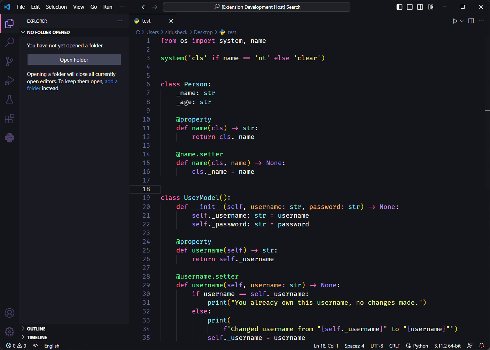

# Darker Night Dracula
This is a theme I made for my personal use based on the syntax highlight of the Dracula theme (which is the theme I always use) and I decided to share it.  
   

# Instalação
### Para instalar através do marketplace do vscode:
* Press **`CTRL + P`**
* Copy and paste the command **`ext install SiriusDev.darker-night-dracula`**
* Press **`ENTER`** 

### Através do arquivo .vsix:
* Baixe a última versão [aqui](https://github.com/pySiriusDev/darker-night-dracula/releases/latest).
* No vscode pressione **`F1`**
* Digite **`vsix`** e clique em **`Extensions: Install from VSIX...`**
* Selecione o arquivo baixdo   

# Links
[GitHub Repository](README.md) 
[Instagram: @biellviana](https://instagram.com/biellviana) 
[Twitter: @_siriusbeck](https://twitter.com/_siriusbeck)